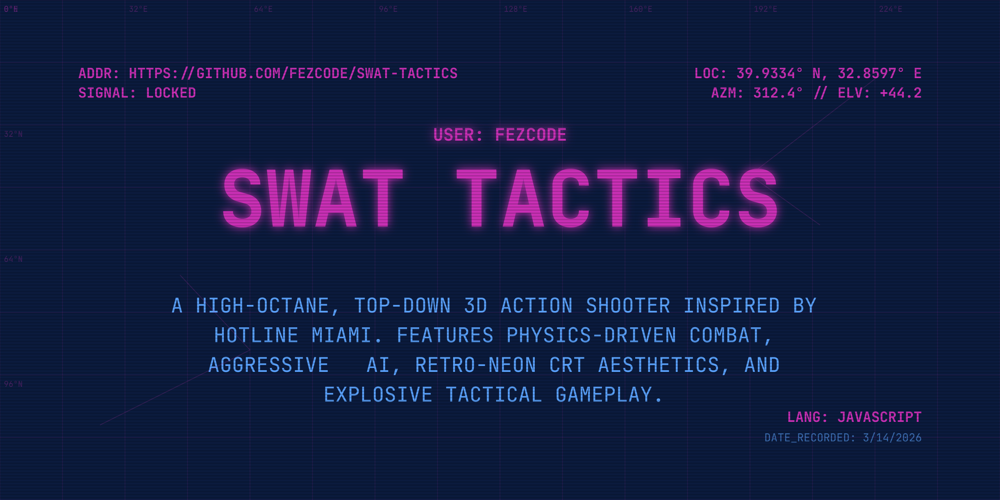

# SWAT TACTICS

**SWAT TACTICS** is a high-octane, top-down 3D action shooter inspired by the fast-paced gameplay and retro-neon aesthetic of *Hotline Miami*. Step into the boots of a tactical operator, clear sectors of hostile targets, and survive the chaos of continuous physics-based combat.

## 🚀 Features

-   **Fast-Paced Combat**: Continuous free-movement 3D shooting. No turns, just action.
-   **Retro-Neon Aesthetic**: VHS scanline overlays, CRT flicker, and a pulsing industrial color palette.
-   **Advanced AI**: Enemies with 360-degree awareness, tactical line-of-sight checks, and barrel-avoidance logic.
-   **Physics-Driven World**: Fully simulated collisions, smooth wall-sliding, and physical projectiles.
-   **Explosive Hazards**: Functional barrels with AoE (Area of Effect) damage and chain reactions.
-   **Dynamic HUD**: Real-time health monitoring, ammo tracking, and mission briefings.
-   **Immersive Audio**: Retro SFX and an atmospheric electronic score.

## 🎮 Controls

| Action | Control |
| :--- | :--- |
| **Move** | `W/A/S/D` or `Arrow Keys` |
| **Aim** | `Mouse Cursor` |
| **Shoot** | `Left Click` |
| **Level Select** | Available in Main Menu |
| **Mute Audio** | Available in System Config |

## 🛠️ Tech Stack

-   **Frontend**: React 19 (TypeScript)
-   **Rendering**: @react-three/fiber & three.js
-   **Physics**: @react-three/rapier
-   **State Management**: Zustand
-   **Styling**: Tailwind CSS 4

## 📜 Credits

-   **Lead Developer**: Fezcode (Samil) - [fezcode.com](https://fezcode.com)
-   **Music**: Dan from Pixabay
-   **Special Thanks**: The open-source community and the ghosts in the machine.

## 📦 Deployment

This project is configured for GitHub Pages. To deploy:

1.  Run `npm run deploy`
2.  Follow the prompts to push the `dist/` folder to the `gh-pages` branch.

---

*Build v0.4.2 // Protocol: Zero Tolerance*
